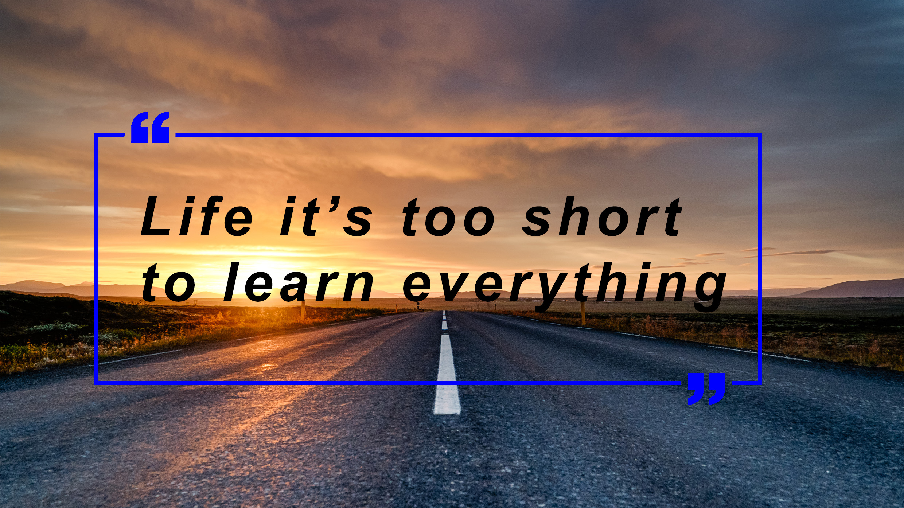

### Hello there 

<table style="float:right;width:50%;margin-left:10px">
    <tr>
        <td colspan="2">
            </td>
    </tr>
    <tr>
        <td align="center">
            
        </td>
        <!--<td align="right">
        <!-- lines of code badge & API --
        </td>-->
    </tr>
</table>

I am [**Cristishor**](https://github.com/Cristishor201), I am tall as **201** cm, and I like pretty much everything in terms of tehnology.
I liked starting building websites, like my own using , , , ,  and .

I liked use my creativity in , building images for my website, or just expressing myself.

And I liked also electronics, which is the reason why I started also some projects here on embedded field, like [ESP8266](https://github.com/Cristishor201/ESP8266), [STM32F407g](https://github.com/Cristishor201/STM32F407), and my electronics [blog](https://www.facebook.com/Atelierul-de-Electronica-111277717034607/) out there.

I am also in mechanics, with my [Faculty of Mechanics Engineering](http://www.mecanica.pub.ro/), with some experience and personal projects on 3D design as well, in *[Catia](https://www.facebook.com/media/set/?set=a.1098765766830548&type=3)*, *[AutoCAD](https://www.facebook.com/media/set/?set=a.2785847508122357&type=3)*, *Inventor*, *Solidworks*. 

In other words I like to build and innovate stuff :hammer_and_wrench:.

The quote from the top of the page *"Life is too short to learn everything"* kinda is my state where I got.
That's why I planning to cheat time, diving in automation IT or IoT, and later even in DevOps. I may want to learn also machine learning, if it is what it says it is. (learning in my place 😅).

------

Joined Github **5** years ago.

Since then I pushed **148** commits, opened **179** issues, submitted **4** pull requests, received **11** stars across **18** personal projects and contributed to **2** public repositories.

Generated using <a href="https://github.com/marketplace/actions/profile-readme-stats">Cristishor201/profile-readme-stats</a>
